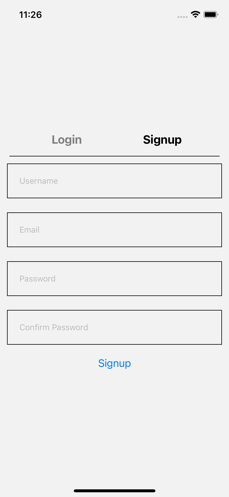
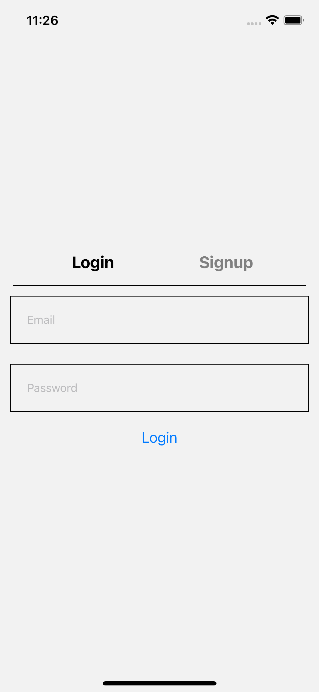
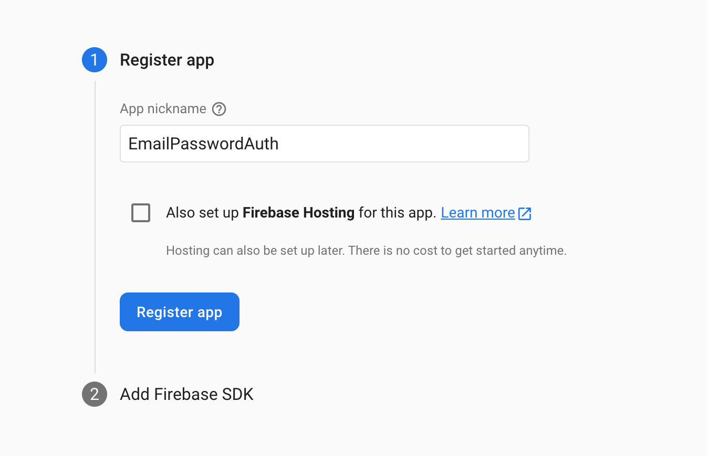
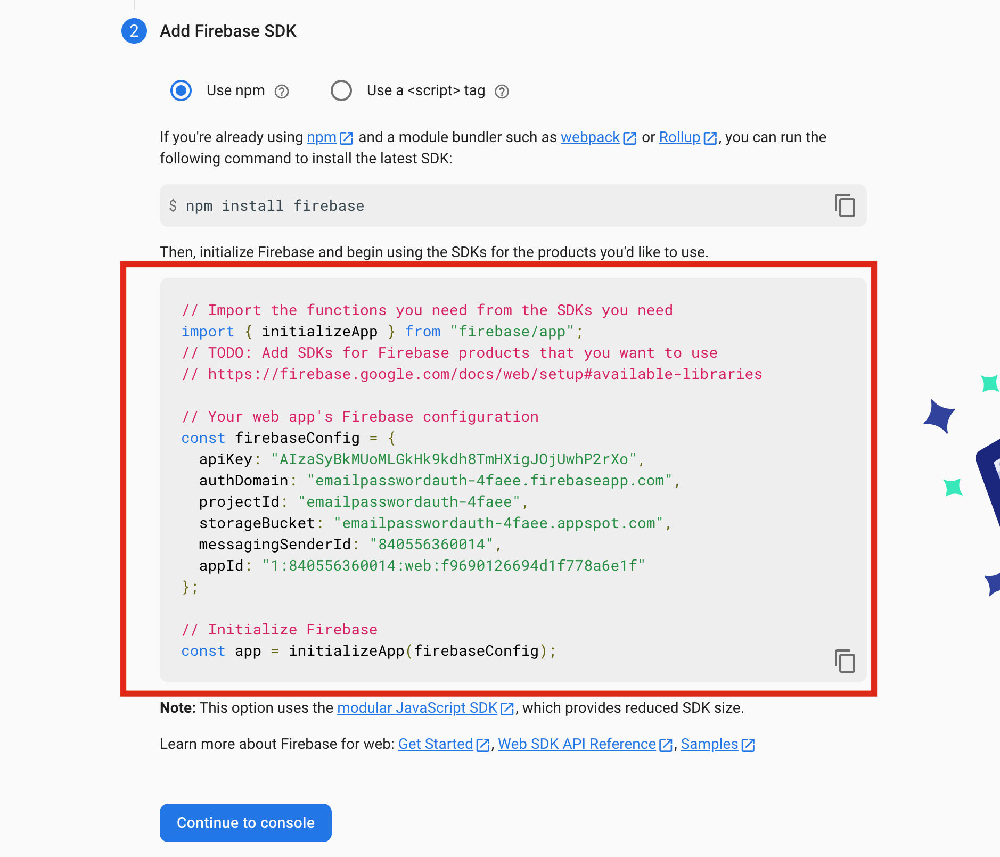
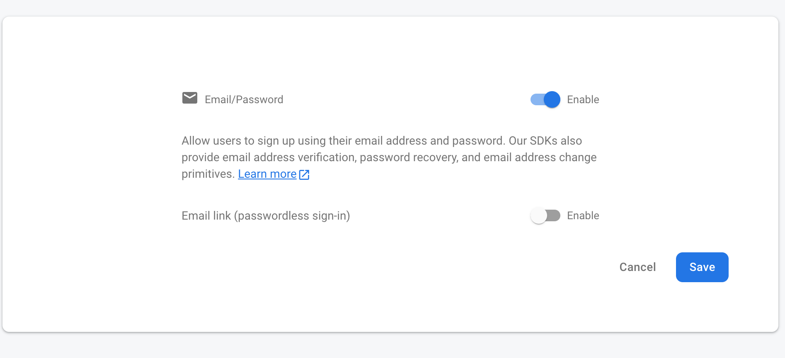

# Email Password Authentication Firebase In React Native Expo

This is a very basic project with only two screens

* Login/Singup Screen
* Home Screen

## Login/Singup Screen

This is a one screen with functionality for both login and signup.




## Home Screen
On this screen we are displaying the login user details with a logout button


## Steps For Authentication
First add the firebase package in your react natice expo project
```
expo install firebase
```

If you only want to use the Email/Password Firebase Authentication in your project. Then you only have to add the **Web App**  in firebase project.




Then make a file named **firebase.js** in the root directory of your project and add the following highlighted code in that file



We **DO NOT** have to do the following command
```
npm install firebase
```
As we are using expo and we have already installed the firebase package using expo


Now add the changes in the code added in the **firebase.js** file

Remove all the imports
And add these
```
import firebase from 'firebase/compat/app'
import 'firebase/compat/auth'
```

And at the end initialize the app by the using the following code
```
let app

if (firebase.apps.length === 0) {
    app = firebase.initializeApp(firebaseConfig)
} else {
    app = firebase.app()
}

const auth = firebase.auth()

export { auth }
```

Then go to your firebase project

Go To Build > Authentication > Get Started > Email/Password > Enable




### Problem / Bug
1. Downgrade the firebase package to version 9.6.11 otherwise the app crashes
1. Accessing the displayName after createUserWithEmailAndPassword method and setting the displayName with updateProfile method in firebase returns the displayName as null. Has to log in again to get the displayName 

